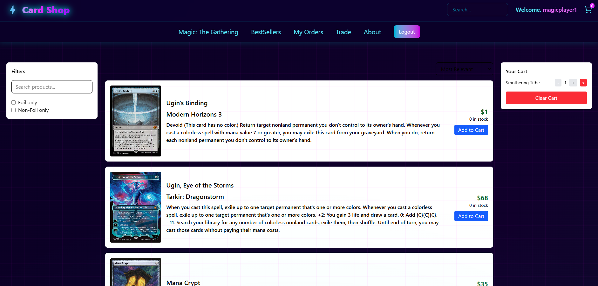
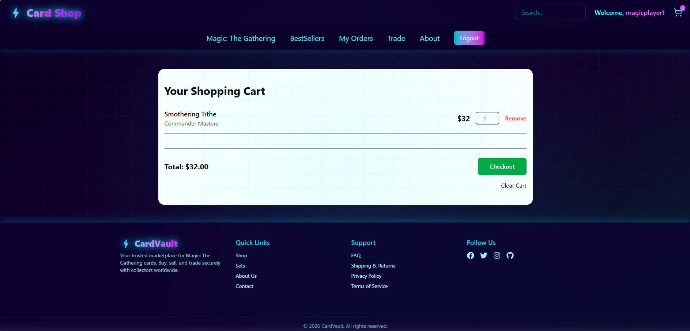
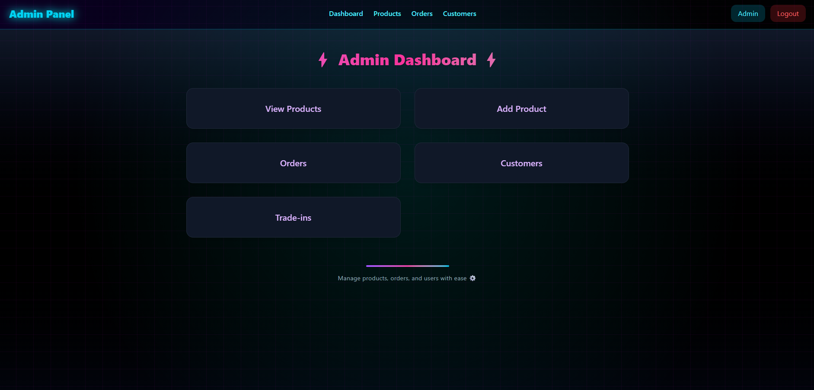

# CardShopApp – React Frontend

CardShopApp is a React-based frontend for the CardShop e-commerce platform. It consumes the CardShop ASP.NET Core Web API to provide a complete shopping and checkout experience.

## Tech Stack
- React
- JavaScript
- HTML / CSS
- REST APIs
- JWT Authentication

## Key Features
- User registration and login with JWT-based authentication
- Protected routes for authenticated users and admins
- Product browsing and search
- Shopping cart and checkout flow
- Integration with Stripe-powered backend endpoints
- Responsive UI for desktop and mobile use

## Architecture & Design
- Separation of concerns between UI components and API services
- Centralized API communication layer
- Protected routes based on authentication state
- Designed to work with the CardShop backend API

## Related Project
- **Backend API:** [CardShop](https://github.com/Justus78/CardShop)

## Screenshots

## Products

## Checkout

## Admin 

